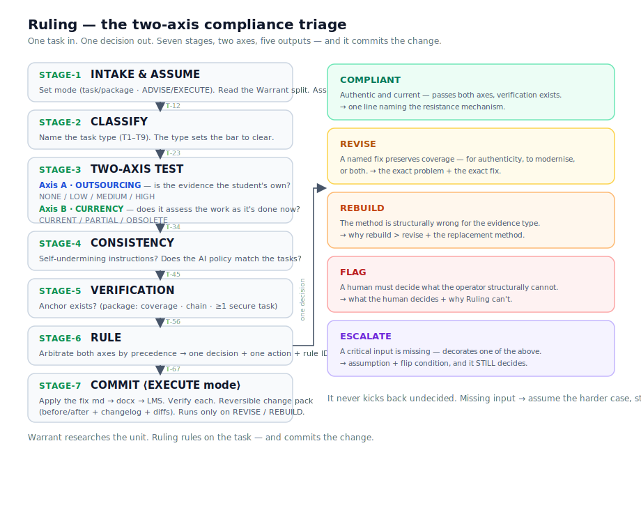

# Ruling

**A folder-based AI operator for Australian VET assessment. It rules on two axes, then commits the change end-to-end.** *The operator pair to [Warrant](https://github.com/hubbardjoshua9-a11y/warrant), the researcher.*

<p align="center">
  
</p>

<p align="center">📺 <b>Walkthrough (~6 min):</b> <a href="https://youtu.be/oTXNnpUabAs">youtu.be/oTXNnpUabAs</a></p>

Ruling doesn't stop at triage or a draft — it decides **and commits** the change: assessment, Word doc, Canvas page, all three, tracked and reversible. Warrant researches where AI has reshaped the unit's real work; Ruling rules on the finished task, acts on that research, and ships the committed change — researcher to operator to committed change.

> **Why this matters even if you've never seen a VET assessment:** AI broke assessment from both sides at once — students can now outsource the evidence, *and* many tasks still test a pre-AI workflow that's gone obsolete. Every RTO has hundreds of these, fixed by hand across Word docs and the LMS under audit risk — exactly the repetitive, high-stakes ops work an operator should own end-to-end.

🔗 **Landing (live):** [hubbardjoshua9-a11y.github.io/ruling](https://hubbardjoshua9-a11y.github.io/ruling/) · **Verify in 2 minutes:** [`JUDGE_GUIDE.md`](JUDGE_GUIDE.md) · **A real end-to-end run:** [`worked-units/`](worked-units/) · **Authenticity-axis run:** [`sample-output.md`](sample-output.md)

---

## Two axes — the upgrade

Most "AI-proofing" asks only *can a student outsource this?* (authenticity). Ruling asks **both** questions on every task:

- **Axis A — Authenticity.** Is the evidence the student's own? (the outsourcing test)
- **Axis B — Currency.** Does the task assess the work the way it's *actually done now*, or a pre-AI workflow the industry has left behind? (the modernisation test)

A task can be authentic and **obsolete**. Ruling catches both, and routes to one decision. The new signature output: *authentic but obsolete → REVISE to modernise.* Ruling never researches the currency question — it **consumes Warrant's Resist/Integrate split** and acts on it (RULE-34). No split, no web search. That firewall keeps it an operator, not a researcher.

## Two modes — it acts, not just advises

- **ADVISE** (default) — rule and stop, touch nothing.
- **EXECUTE** — apply the decision across the assessment **md → docx → LMS**, leaving a **change pack** (authorising ruling, changelog, `before/`+`after/`, diff cards). Reversible (rollback tested byte-identical) and auditable — no silent overwrite. *Task in → decision → committed change out.*

## The researcher and the operator

> **[Warrant](https://github.com/hubbardjoshua9-a11y/warrant) researches the unit. Ruling rules on the task — and acts on it.**

**Warrant** (the researcher, Comp #6) investigates how AI is reshaping a unit's real work and produces a **Resist/Integrate split**. **Ruling** (the operator, this week) takes a finished task, makes the compliance call **acting on that split**, and commits the fix. Warrant finds where the work changed; Ruling enforces authenticity, modernises what's obsolete, and ships it. The seam between them is the split — the Resist/Integrate format shown in each worked unit's `input-split.md`.

## What's in this repo

```
Ruling/
├── README.md                 ← you are here
├── JUDGE_GUIDE.md            ← eight falsifiable tests (both axes + execute)
├── sample-output.md          ← authenticity-axis run on three sample inputs
│
├── ruling/                   ← THE OPERATOR (drop this folder into a Claude project)
│   ├── identity.md           ← the eight primitives (IDENT-01…08)
│   ├── rules.md              ← the numbered law (RULE-00…38 + edge cases)
│   ├── examples.md           ← seven worked rulings — all outputs, both axes
│   ├── README.md             ← how to load and run the operator
│   └── reference/
│       ├── decision-tree.md          ← the seven-stage machine + two-axis matrix
│       ├── outsourcing-test.md       ← Axis A (authenticity)
│       ├── currency-test.md          ← Axis B (currency/modernisation)
│       ├── assessment-task-types.md  ← the T1–T9 classification
│       ├── evidence-requirements.md  ← V-S-A-C, the REBUILD trigger
│       ├── ai-policy-patterns.md     ← the contradiction catalogue (P1–P6)
│       ├── output-templates.md       ← the shape of every ruling
│       └── execute/                  ← the commit layer (STAGE-7)
│           ├── change-pack.md  apply-to-md.md  apply-to-docx.md  apply-to-lms.md
│
├── worked-units/             ← Ruling on REAL Learnbuilt units (the evidence)
│   ├── BSBTEC201/            ← AI-affected · full EXECUTE run + change pack
│   ├── BSBWHS411/            ← mixed · both axes firing
│   └── CHCDIV001/            ← AI-thin · the restraint case
│
├── sample-inputs/            ← three RTO tasks (authenticity axis) → REVISE / COMPLIANT / FLAG
├── landing/index.html        ← one-page site, Learnbuilt-branded, GitHub Pages ready
└── assets/decision-flow.svg  ← the decision diagram
```

The researcher side lives in [Warrant](https://github.com/hubbardjoshua9-a11y/warrant); the Resist/Integrate splits Ruling consumes are mirrored in each worked unit's `input-split.md`.

## The five decisions

| Decision | When | What you get back |
|---|---|---|
| **COMPLIANT** | Passes the outsourcing test, no self-contradiction, verification exists | One line naming the resistance mechanism |
| **REVISE** | A named fix preserves coverage | The exact problem + the exact fix |
| **REBUILD** | The method is structurally wrong for the evidence type | Why rebuild beats revise + the replacement method |
| **FLAG** | A human must decide something the operator structurally cannot | What the human decides + why the operator can't |
| **ESCALATE** | A critical input is missing | The assumption, the flip condition, and the decision made *under* it |

The move that makes it an operator: **it never kicks back undecided.** Missing the delivery mode? It assumes online/unmonitored, says so, and rules. Missing something that could flip the call? ESCALATE — it states the assumption, names what would change the decision, and still decides.

## How to run it

1. Open this repo in Claude Code (needed for EXECUTE mode), **or** add the contents of `ruling/` to a Claude project's knowledge (ADVISE mode).
2. Instruction: *"Read identity.md and rules.md. You are Ruling. Score authenticity and currency, output one decision with one action, cite the rule IDs. Never ask me what to do — assume and state. Default to ADVISE; only EXECUTE when I ask, and supply the unit's files."*
3. Paste an assessment task or package (add a Warrant split to assess currency). Read the ruling. To execute, point it at a unit's files and ask it to commit.

Start with [`JUDGE_GUIDE.md`](JUDGE_GUIDE.md) — eight copy-paste prompts that each tell you the decision Ruling must reach and the rule that forces it.

## Scope & honesty

Ruling rules on the **assessment method only** — never the fixed evidence, never the vocational content. It takes the task at face value and does **not** validate whether the unit's requirements are right (that's Warrant's job and the regulator's). It will not endorse AI detectors: a prohibition is never a mechanism. Its reference files are the law it applies, against stable principles of evidence; where a call depends on current ASQA/TEQSA wording it FLAGs that rather than asserting it.

Built by an Australian RTO practitioner on interpretable-context (folder-as-architecture) methodology — the folder *is* the system, and each file does one job.

---
*Weekly Comp #7 — The Operator. Pair to Warrant (Comp #6).*
